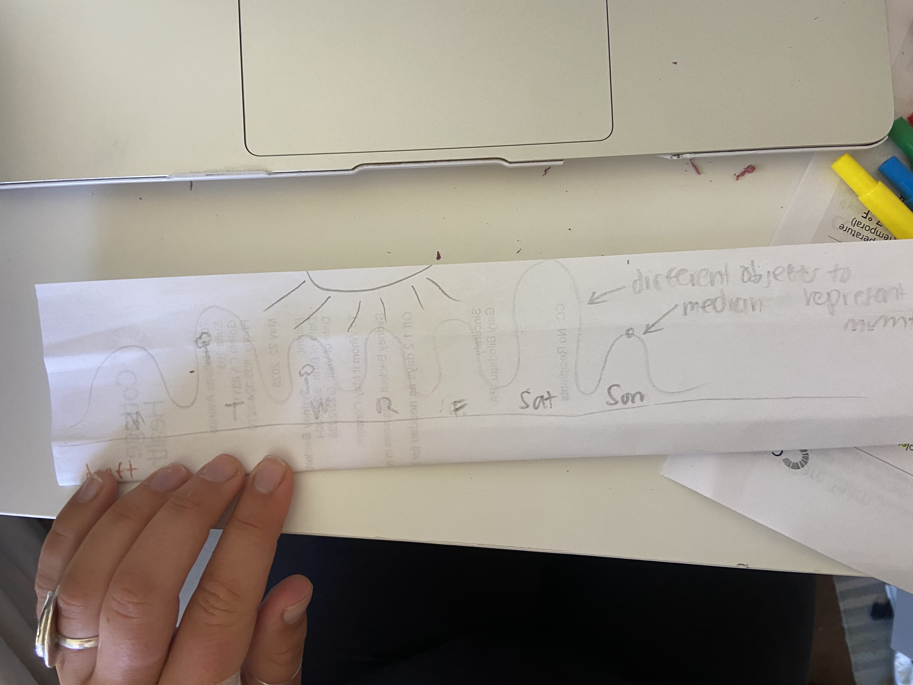

---
html_document:
  toc: true
  toc_float: true
author: "Sydney Beckett"
date: "05/28/25"
title: "Homework 3"
---

https://github.com/sydneymbeckett/ENVS-193DS_homework-03.git

```{r setup, include=TRUE, warning=FALSE, message=FALSE}
library(tidyverse)
library(here)
library(gt)
library(janitor)
library(readxl)
ENVS193_FinalData_Sheet1 <- read.csv("data/ENVS193-FinalData - Sheet1.csv") #reading in data

```


**Problem 1**

## a.

I could calculate the mean number of steps I took each day to compare average step counts between days when I had class and days when I didn’t, because I think I walk more on days I have class because I walk between classes and from my bike. I could also compare the mean number of steps based on the type of exercise I did, since I expect activities like running to result in more steps than yoga or rest days.

## b.

```{r}
# Convert Steps from character with commas to numeric
ENVS193_FinalData_Sheet1 <- ENVS193_FinalData_Sheet1 %>%
  mutate(
    Steps = as.numeric(gsub(",", "", Steps))
  )

ENVS193_FinalData_Sheet1$Day.of.the.Week <- factor(
  ENVS193_FinalData_Sheet1$Day.of.the.Week,
  levels = c("Monday", "Tuesday", "Wednesday", "Thursday", "Friday", "Saturday", "Sunday")
) #ordering by days of the week

ggplot(ENVS193_FinalData_Sheet1, aes(x = Day.of.the.Week, #using ggplot with my data and using day of week for x axis
                          y = Steps, #using steps for y axis
                          fill = Day.of.the.Week))+ 
  # Remove commas and convert to numeric
  geom_boxplot(alpha = 0.7, #creating a boxplot and changing transparency using alpha
               
               ) +
  geom_jitter(width = 0.2, size = 1.5, alpha = 0.5, color = "black", na.rm = TRUE) + #using jitter to show individual data and changing width size transparency and color of the points, na.rm = TRUE just makes sure that no warning messages come up
  scale_fill_brewer(palette = "Set2") + #custom color palette
  scale_y_continuous(
    limits = c(0, max(ENVS193_FinalData_Sheet1$Steps, na.rm = TRUE)),
    breaks = scales::pretty_breaks(n = 5),
    labels = scales::comma
  ) +
  labs(title = "Distribution of Steps by Day of the Week", #naming the boxplot
       x = "Day of the Week", #naming x axis
       y = "Number of Steps") + #naming y axis
  
  theme_minimal(base_size = 14) + #using a custom theme
  theme(legend.position = "none", #removing legend becuase it is uneccessary
        axis.text.x = element_text(angle = 45, hjust = 1)) #changes the day of the week to be at an angle so they take up less space
  
```


## c.
Figure 1: Distribution of daily step counts by day of the week.

Each box represents the range and median of steps taken, while the individual black points show the underlying data. This visualization highlights how activity levels vary throughout the week, with a higher median on Saturdays, and low variability on Tuesdays. 

## d. 
```{r}
ENVS193_FinalData_Sheet1$Day.of.the.Week <- factor(ENVS193_FinalData_Sheet1$Day.of.the.Week,
                                levels = c("Monday", "Tuesday", "Wednesday", "Thursday", "Friday", "Saturday", "Sunday")) #ordering by days of the week
summary_table <- ENVS193_FinalData_Sheet1 |> #summarize data using my personal data
  group_by(Day.of.the.Week) |> #grouping the data by day of week
  summarise(`Average Steps` = round(mean(Steps, na.rm = TRUE), 1))  # Round to 1 decimal
summary_table |> 
  gt() |> #using gt package to create a table
  tab_header(
    title = "Average Steps by Day of the Week" #naming the table
  ) |>
  cols_label(
    Day.of.the.Week = "Day", #naming the title of the column on the left day
    `Average Steps` = "Mean Steps" #naming the title of the column on the right mean steps
  )
```

**Problem 2**

## a.
An affective visualization of my step data could be a winding hiking trail that passes through a series of mountains, each labeled with a day of the week. The height of each mountain would represent the number of steps taken on that day—tall peaks for active days and gentle hills for quieter ones. Along the trail, small details like trees, footprints, or resting spots could hint at the emotions or experiences of each day, turning the data into a visual journey.

## b.



## c.


## d.
In my art I am showing the change in my daily movement(in steps) throughout the week.
I found Jill Peltos paintings really inspiring, I liked the mountain art she did to show decline in ice sheets, it inspired me to use the height of a natural object to show the change across time. It also helped me understand how nature can evoke different emotions when paired with data.
I chose to use colored pencils for my work because it allowed me to use more detail in terms of color and shape, over coding.
I created a sketch to start to decide what data I wanted to include, I decided to include the average step count of each day and then use a line to connect them so that the data could be shown a little more prominently. I then sketched it out using pencil and colored over using colored pencils, I decided to make there be different colors coming from the sun onto each day, and I had each color represent a different feeling in terms of energy. 

**Problem 3**

## a.
This paper addresses the impact of MPA on landings and income per unit of effort. The tests they used includes a t-test. The predictor variable is the MPA status, inside vs outside the MPA and before vs after. The response variable are the landings or the income per unit of effort(LPUE, IPUE). This paper also includes a Wilcoxon test which is used alongside the t test to compare differences in the LPUE, IPUE and prices before and after the MPA implementation. 


## b.

The x axes are logically organized by the categorical variable and the y axes are labeled with units that make it easy to understand. In terms of summary statistics, the figures clearly show mean and standard error (or) confidence interval. There are also line plots which show the raw time series data, and the bar plots help to summarize these trends which helps condense the data. 

## c.
These figures use minimal clutter, different plots are clearly laid out, the icons for different species are small and dont distract, and the use of grayscale for the bars avoids u necessary color while still making a clear distinction. There is no redundant gridline use, flashy colors or other effects that reduce the ratio of data:ink.

## d.
My first recommendation would be to clarify the units on the y axis a little bit more, ex: "mean log(LPUE)" or "income per trip", but switching to something like "Mean log(LPUE) (kg/hour) and "income per trip(USD)" might add some clarity for a less knowledgeable audience. Also, some of the panels show percentages and p values but not consistently, so using a small legend to explain what the change refers to would add a lot of clarity for the reader. Including the raw data points alongside the smooth trend line would also be helpful, could be through semi transparent dots(jittered if needed), I think it would just help to develop the figure to be able to see variability. Lastly, while the x axis name, "before"/"after" is very simple, I think it would add a lot more clarity to add another word or two to describe what the before and after are refferring to. 
